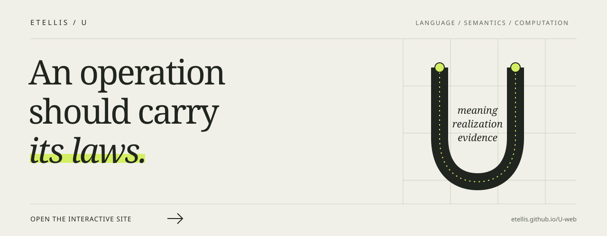

[](https://etellis.github.io/U-web/)

<h1 align="center">U</h1>
<p align="center"><strong>Law-bearing operations</strong><br>One composition discipline. Explicit mathematical worlds.</p>
<p align="center"><a href="https://etellis.github.io/U-web/">Explore the interactive site ↗</a> · <a href="#run">Run</a> · <a href="docs/ARCHITECTURE.md">Architecture</a> · <a href="paper/main.pdf">Paper</a> · <a href="CLAIMS.md">Support &amp; limitations</a> · <a href="https://etellis.github.io/BiDi-web/">BiDi</a></p>

U is a programming language whose operations carry the laws governing how they may connect, observe, repeat or share. Its compiler is written in U. The graph representation, standard libraries, proof kernel and CDC analysis are U programs that compile to native functions.

```sh
./bin/etellis-u run examples/original/02_arithmetic.u --entry square --args '[7]'
```

The result is `49`. The same path handles lexical closures and arbitrary-precision integers, including the exact 100th Fibonacci number.

The larger aim is to bring values, memory, relations, probability, concurrent behavior, dynamics and coherent state into one inspectable representation while retaining the distinctions that give each domain its meaning. A probability distribution and a numerical trajectory may share a composition structure. Their laws still differ.

## Run

Clone the implementation repository and use the native launcher:

```sh
git clone https://github.com/ETEllis/U.git
cd U
./bin/etellis-u --version
./bin/etellis-u run examples/original/02_arithmetic.u --entry square --args '[7]'
./bin/etellis-u run examples/original/03_fibonacci.u --entry fib --args '[100]'
```

A C11 toolchain is required. The initial build uses a checked generated-C seed; subsequent source translation runs through the U compiler. Python is not required by ordinary compilation or program execution. Independent reference implementations and test harnesses have their own development dependencies.

The language uses UTF-8 source, a versioned header, named imports, definitions, calls and typed regions:

```u
u "etellis.u/0.1";
use "u.standard/0.1";

def square(x: Int) -> Int = int.mul(x, x);
```

Inspect a program's graph, check its source, or build an executable:

```sh
./bin/etellis-u explain examples/original/02_arithmetic.u
./bin/etellis-u check examples/original/02_arithmetic.u
./bin/etellis-u build examples/original/02_arithmetic.u --entry square --output build/square
```

Build records identify the source, operation graph, compiler, runtime and library dependencies. Execution that needs console, filesystem, network or other platform access requires the corresponding supported capability. Parsing and checking are inert.

The qualified executable is `etellis-u`; the language identifier is `etellis.u`. The project uses `.u` without claiming exclusive ownership of that existing extension.

## What runs in U

The implementation is organized by the responsibility each part owns.

| Area | Native U implementation | Current boundary |
|---|---|---|
| Compiler and graph | Scanning, parsing, lexical and core type checks, six-constructor lowering, reconstruction, closure conversion and C generation | General dependent refinements and complete theory admission remain separate obligations |
| Values and syntax | Natural recursion, collections, closures, quotation, splicing and single-evaluation binding | Staging and resource guarantees apply to their supported contracts |
| Relations and probability | Unification with occurs checks, relational search, bag-preserving joins, weighted models and conditioning | Search and inference policies are explicit; arbitrary source-language import is not implemented |
| Behavior | Local tasks, failure and cancellation, HTTP operations, actor supervision and finite temporal checks | Distributed deployment and all-schedule correctness require additional evidence |
| Scientific models | Array operations, affine index-1 backward Euler, clocked register simulation, partitioned launch simulation and joint statevectors | Numerical and simulated results retain their model and realization limits |
| Proof and evidence | A total Nat/Pi/Eq checker, checked handles, subject identities and guarded consequences | The kernel proves its admitted judgments; it is not a complete dependent type theory |
| CDC | Finite flow, ternary commit, nested exchange, recorded paths, ordered tangents, recurrence, return operators and triangular spectra | Full U1 binding, localized-event dynamics and general dense spectral analysis remain open |

The [current verification report](artifacts/native-verification.json), [self-compilation record](tests/selfhost/verification.json) and [support inventory](CLAIMS.md) identify the exercised cases and remaining limits. The original [22 examples](examples/original/) preserve the design's breadth. Graph reconstruction of an example and execution of all its operations are separate results.

## The compiler belongs to the language

The production path parses U source, lowers its executable bodies into an operation graph, validates reconstruction from that graph, and emits native functions. Source bytes remain available as provenance; they are not replayed to reconstruct the program. The graph retains qualified operations, bindings, declared interfaces, stages, evaluation order and resource obligations.

The compiler rebuilds itself through three stages. Generated C is identical across the tested stages, and native executables built under the recorded toolchain reproduce byte-for-byte when compared with the same output basename. Independent checks run with no interpreter available in the compiler's or generated programs' search path. See [self-hosting](docs/SELF_HOSTING.md) for the procedure and exact scope.

C serves as a portable machine target. The handwritten platform bridge supplies generic values, arbitrary-precision arithmetic, storage, function calls and operating-system access; declared platform implementations provide TLS and SHA-256. Language and domain algorithms live in U. The bridge uses a bounded process arena and releases it at exit; long-running garbage collection remains a runtime requirement. Its complete contract is in [the native ABI](native/ABI.md).

The generated-C bootstrap and the independent historical reference remain useful trust boundaries. Self-compilation establishes that U can reproduce its translator. Compiler correctness, domain laws and resistance to a compromised toolchain require their own arguments.

## Meaning, realization and evidence

An equation retains its meaning before a solver runs. A probability model describes more than one sample. A proof candidate becomes a theorem only after its judgment is checked.

U makes these relationships explicit:

| Object | What it records | The question it answers |
|---|---|---|
| **Meaning** | Operation graph, semantic profile, observables, numeric contracts, dependencies and assumptions | Which behaviors and transformations are permitted? |
| **Realization** | Compiler, solver, evaluator or device implementation and its contract | How is the operation carried out here? |
| **Evidence** | Subject identity, method, inputs, result and outstanding conditions | What has been established about this operation and result? |

A backend change preserves meaning only when every relevant contract remains fixed. Precision, event order, observation policy and rounding can affect the represented meaning itself.

## Six structural constructors

```text
wire   forward or permute existing ports
gen    apply an operation under its declared contract
seq    connect operations in order
par    compose branches under an independence witness
scope  bind a fresh name or region
fix    iterate under a declared recursion or feedback discipline
```

The structure stays small while each operation retains its mathematical obligations. Generators expose their identity and declared interfaces. The native graph checks nominal bindings, arities, order, stages and reconstruction; it records unresolved type, resource and theory requirements explicitly.

A wire cannot create a second owner. Parallel structure requires an independence account. A scope does not itself allocate a physical resource, and unrestricted recursion cannot manufacture a total proof.

Seven theory families organize the laws that distinguish their domains:

| Family | Responsibility | A distinction that must survive |
|---|---|---|
| **V: values and proofs** | Data, closures, total proof terms, staged syntax | Checked judgment versus partial computation |
| **M: resources and memory** | Ownership, borrowing, allocation identity and access | A resource versus its current contents |
| **R: relations and search** | Unification, multiplicity, queries and search policy | Relation versus answer order |
| **P: measures and probability** | Measures, weighting, conditioning and inference | Distribution versus sample |
| **C: behavior and clocks** | Causality, messages, schedules and registers | Possible behavior versus one trace |
| **D: paths and dynamics** | Equations, trajectories, events, derivatives and frames | Continuous description versus numerical map |
| **Q: coherent state and instruments** | Joint state, transformation, observation and reset | Phase coherence versus classical mixture |

Q's current mathematical profile uses complex amplitudes, Hilbert spaces, channels and measurement instruments, including quantum-process semantics. Its operational role is to preserve how joint state composes and how observation changes what is available. Other models require their own declared contracts and preservation tests. A classical statevector calculation and a physical realization have different evidence requirements.

These families organize obligations without claiming a globally minimal foundation. The [operator contracts](provenance/source/OPERATOR_CONTRACTS.md) give the detailed accounting.

## Lawful composition

Two operations can each make sense while their composition does not. U's design requires an admitted composite profile or a checked adapter at the boundary. Readable source can remain concise while the graph makes those conditions explicit.

Choose a bit before seeing a fair coin and the best chance of matching is one half. Observe the coin first and it is one. The operation names are the same; the available information changes the result. Reordering those operations needs a law that this example does not satisfy.

An adapter therefore records its interface map, preservation relation, observables, assumptions, information loss and checking method. Exact, refining and approximate bridges remain distinct. A numerical solver's local tolerance is not automatically a global error theorem.

Admission has several dimensions: where an operation comes from, which realizations support it, what evidence exists, and which components must be trusted. The graph's structural checks do not silently discharge every domain obligation.

## Proof and guarded consequences

The proof kernel is itself a U program. The preserved induction example checks the closed Nat/Pi/Eq judgment that `0 + n = n`:

```sh
./bin/etellis-u prove examples/original/14_proof.u --entry checked
```

Its addition recurses on the second argument, so the general result needs induction. An ordinary function with an attractive proof annotation cannot substitute for a checked derivation. Search and tactics may propose terms; only the supported total kernel checks them.

Evidence also has a subject. CDC's path, tangent, recurrence and return handles are tied to the same recorded execution. A JSON object, a matching handle label or a certificate from another run cannot supply that relationship. When a later step holds, the earlier valid results remain available.

The [formal paper](paper/main.pdf) proves conditional statements about explicit mathematical models. The implementation is assessed separately through execution, independent comparisons and adversarial checks. Those forms of evidence complement one another.

## CDC and BiDi

[BiDi](https://etellis.github.io/BiDi-web/) predates U. Its Coherence-Delta Calculus supplies a concrete source language, native state reducer and evidence discipline. U develops a wider substrate from that experience; CDC remains a specialization with its own phase maps, balanced-ternary barrier and guarded analysis.

The compatibility reference is BiDi commit `1307f2a7f32ab5beb64fe5cd0c0faf13ec9c8157`: release 0.3.0, grammar 1, C ABI 1.5. The original `cdc` command, `.cdc` source, ABI and proof namespaces retain their identities.

U implements CDC's three reductions directly:

- `flow(d)` updates the phase state synchronously under the pinned finite map.
- `commit(m)` quantizes to balanced ternary and enforces its nonnegative-prefix barrier.
- `nest(parent, child)` performs the declared belief/prior exchange.

The U analysis records the executed path, differentiates its actual maps in order, checks complete-state recurrence and constructs a return operator only when that return is verified. Relative phase restoration includes its declared action and derivative. Triangular return operators have a validated spectral path; a general dense matrix currently yields a typed hold while preserving the return operator.

The live two-turn example illustrates the distinction. The state does not return absolutely: its unwrapped phase advances by `4π`. An explicit two-turn phase restoration returns the complete selected state and yields an identity return operator with a marginal spectrum. This exercises the U analysis mechanism. It does not turn BiDi's canonical loop into a recurrent orbit or establish complete U1 parity.

The [BiDi crosswalk](docs/ARCHITECTURE.md#bidi-crosswalk) connects its source language, formal spine, frameworks, U1/U2 and verification obligations to the corresponding U work.

## Native possession and import

Native support requires the relevant operations and laws to participate in U's own representation, analysis and execution. The intended import relation is:

```text
source → typed U graph + residual + provenance
```

Residuals retain lexical details, names, environmental assumptions and unsupported regions. Exact source reconstruction and semantic preservation are separate obligations. A preserved text string does not establish native understanding of the program it contains.

The current graph reconstructs U source structures and keeps their provenance. General foreign-language frontends, broad law-aware transformations, complete domain admission and physical backends remain further work. Transformations must update the residual through a valid reconstruction rule or invalidate exact export.

## Repository map

```text
compiler/           U compiler and six-constructor graph
stdlib/             U language and domain libraries
cdc/                U CDC reductions and analysis
tools/              U command-line, linkage and language-server tools
native/             declared platform bridge
bootstrap/          checked seed and reproducible self-build
bin/                public command-line entry point
examples/original/  preserved design examples
tests/              executable, independent and adversarial checks
docs/               contracts and architecture
landing/            interactive public website
paper/              manuscript, bibliography and source bundle
provenance/         preserved design and review history
```

The [design history](DESIGN_HISTORY.md) records the distinction between preserved source material and later implementation work.

## Research and citation

U builds on typed intermediate representations, algebraic effects, resource-sensitive reasoning, open-system composition and bidirectional transformations. The research question concerns their integrated execution discipline: can one useful language keep laws, realization, preservation and consequences explicit enough to support work across domains?

Read the [research preprint](paper/main.pdf), [LaTeX source](paper/main.tex), [bibliography](paper/references.bib) and [citation metadata](CITATION.cff). The manuscript is prepared for arXiv and has not been submitted or peer reviewed. Edward Ellis is the author; AI assistance is disclosed in the paper.
